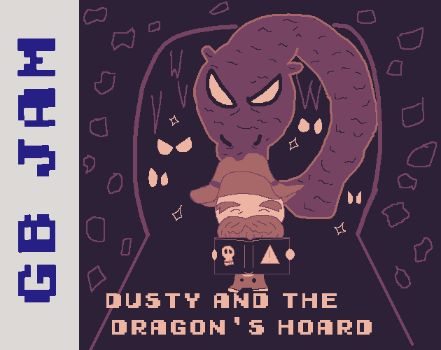

<h1 align="center">Dusty and the Dragon's Hoard</h1>

  

Play as the titular Dusty as you combine mysterious magical runes in search of the Dragon's **old gold.**

Made for the [GBJam 14](https://itch.io/jam/gbjam-14) with the theme **Old Gold**. See the itch.io page [here](https://treeii.itch.io/dusty-and-the-dragons-hoard)

  

## Controls

| Input | Action |
|---|---|
| **Arrow Keys** | Navigate (primarily left and right) |
| **Z** (representing A on Gameboy) | Select Runes / Accept |
| **X** (representing B on Gameboy) | Cast Spell (w/ selected runes) / Skip Room |
| **Enter** (representing START on Gameboy) | Primarily for restarting the game |

## How To Play

Select runes from your hand using the arrow keys and select 2 with **[Z]**, cast the combination using **[X]**. Different combinations produce different effects, experiment and find out!

Between fights you'll find chests of gold and the 2 headed shop keep.

<strong>SPOILERS FOR RUNE COMBINATIONS - Click to reveal</strong>

 

 - fire

 - stone

 - storm

 - gold

 - death

### Rune Combinations

| Combination | Effect |
|---|---|
| **fire + fire** | Deal 5 damage. |
| **fire + stone** | Deal 3 damage and gain 3 block. |
| **fire + storm** | Deal 1 damage 4 times. |
| **fire + gold** | Deal damage equal to your current gold. Lose 5 gold. |
| **fire + death** | Deal 20 damage, then take 10 delayed damage. |
| **stone + stone** | Gain 5 block. |
| **stone + storm** | Stun the enemy for 1 turn. |
| **stone + gold** | Gain block equal to your current gold. |
| **stone + death** | Gain 100 block, but lose 3 health. |
| **storm + storm** | Deal 2 damage repeatedly. Each additional strike has a decreasing chance of occurring. |
| **storm + gold** | Deal 1 damage once for every gold you currently have. |
| **storm + death** | Deal 15 damage 3 times, but lose 10 health. |
| **gold + gold** | Gain 10 gold. |
| **gold + death** | Lose 2 health and gain 20 gold. |
| **death + death** | Gamble with death. There is a 70% chance the enemy dies instantly and a 30% chance you die instead. |

