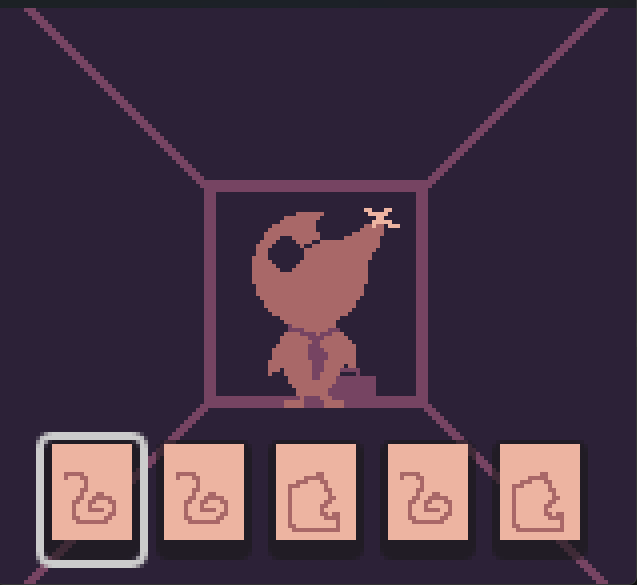

# Dusty and the Dragon's Hoard

**Dusty and the Dragon's Hoard** is a Game Boy-style rune-combining roguelite created for **GBJam 14** and the theme **"Old Gold."**

Play as Dusty, an old-timey prospector who has stumbled across something considerably stranger than gold. Armed with mysterious magical runes, descend deeper into the mine, battle bizarre creatures, collect as much gold as you can, and discover what exactly has been hoarding all that treasure.

Surely nothing bad could be waiting at the bottom.

## Gameplay

Combat revolves around combining pairs of rune cards to create different effects.

Dusty begins his expedition with three types of runes:

- 🔥 **Flame**
- 🪨 **Stone**
- ⚡ **Storm**

Select two rune cards from your hand to combine their effects and cast a spell. As you descend deeper into the mine, new runes and combinations become available.

Along the way you'll encounter strange monsters, opportunities to strike it rich, and increasingly concerning evidence that this might not be an ordinary gold mine.

## Controls

| Input | Keyboard |
| --- | --- |
| D-Pad | Arrow Keys |
| A | Z |
| B | X |
| Start | Enter |

The game is designed to be playable entirely with Game Boy-style controls.

## Made For

**GBJam 14**

Theme: **Old Gold**

The game uses the original Game Boy resolution of **160×144** and is designed around the limitations and aesthetic of the hardware.

## Built With

- [Godot Engine](https://godotengine.org/)
- GDScript
- Pixel art
- Original music and sound

## Development

This game was created during a game jam, so expect gold, questionable magic, strange things living underground, and decisions made under severe time constraints.

## Credits

**Design, Programming, Art & Music:** [Your Name]

## License

TBD
